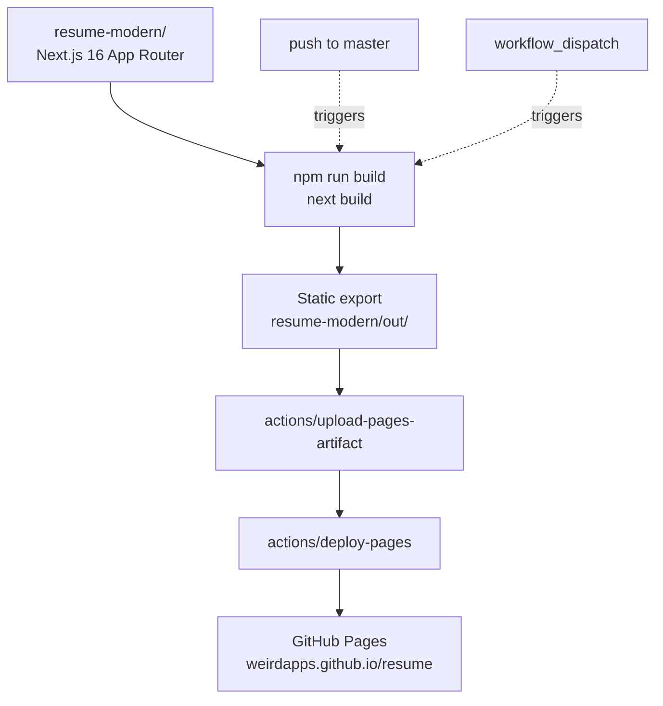

# resume

[](https://github.com/weirdapps/resume/actions/workflows/deploy.yml)
[](https://github.com/weirdapps/resume/actions/workflows/quality.yml)
[](https://github.com/weirdapps/resume/actions/workflows/codeql.yml)
[](https://github.com/weirdapps/resume/actions/workflows/sonarcloud.yml)
[](LICENSE)

Personal resume / CV website for Dimitrios Plessas (AGM, Cards & Digital Business at National Bank of Greece; ex McKinsey). A single-page Next.js site, statically exported and served from GitHub Pages, with light/dark theming, subtle motion, and a print-friendly stylesheet so the browser view doubles as a PDF.

**Live site**: <https://weirdapps.github.io/resume/>

## Contents

- [What this is](#what-this-is)
- [Features](#features)
- [Architecture](#architecture)
- [Local development](#local-development)
- [Build](#build)
- [Deployment](#deployment)
- [Editing CV content](#editing-cv-content)
- [Continuous integration](#continuous-integration)
- [Repository layout](#repository-layout)
- [License](#license)

## What this is

A hand-written Next.js 16 application (App Router, `output: 'export'`) whose sole page renders one CV. There is no CMS, no API route, no database: the CV content lives inline in the React components under `resume-modern/components/`. The build produces a fully static bundle in `resume-modern/out/`, which the deploy workflow uploads to GitHub Pages under the `/resume` base path.

The app is intentionally small (about 10 components, one page, one layout), so any change to the CV is a small, reviewable edit to a `.tsx` file.

## Features

Grounded in `resume-modern/`:

- **Static export**, no server runtime. `next.config.js` sets `output: 'export'` and `images.unoptimized: true`; `basePath` and `assetPrefix` switch to `/resume` in production so the bundle sits happily under `https://weirdapps.github.io/resume/`.
- **Light / dark / system theme**, powered by `next-themes` (`components/theme-provider.tsx`) with a floating toggle button (`components/theme-toggle.tsx`) that swaps sun / moon icons.
- **Motion**, via `framer-motion`. Every section fades and slides in on mount with staggered delays; the theme toggle scales on hover / tap.
- **Responsive two-column layout** using Tailwind's grid utilities: a single column on mobile, a three-column desktop grid where the left column holds personal info / education / skills / interests and the right column holds experience / board memberships.
- **Print-ready**. The stylesheet in `app/globals.css` defines a `.print-hidden` utility that removes the theme toggle and footer under `@media print`, so `Cmd/Ctrl+P` gives a clean PDF straight from the browser.
- **Real content sections** (each is its own component):
  - `header.tsx`: name, one-line tagline, location, phone, email, LinkedIn, profile photo.
  - `personal-info.tsx`: nationality, date of birth, marital status.
  - `education.tsx`: two degrees (AUEB, NTUA).
  - `skills.tsx`: three languages with animated proficiency bars, plus a tag cloud of professional skills.
  - `interests.tsx`: five icon-tagged interests.
  - `experience.tsx`: six roles (National Bank of Greece and McKinsey & Company), each with a bulleted responsibility list and a CSS timeline rail.
  - `board-memberships.tsx`: three board memberships (DIAS, NBG Pay, NBG Bancassurance).
  - `footer.tsx`: year and LinkedIn link.
- **Typography**: Inter, loaded via `next/font/google` with a CSS variable and wired into Tailwind's `fontFamily.sans`.
- **Color palette**: a custom sky-blue `primary` scale (50 to 950) defined in `tailwind.config.js`, used consistently across icons, headings, timeline dots, and tag chips.

## Architecture



The pipeline lives in `.github/workflows/deploy.yml` and runs on every push to `master` (plus manual `workflow_dispatch`). Node.js 22 is used for both build and cache steps.

## Local development

Everything runs from `resume-modern/`, not the repo root.

```bash
cd resume-modern
npm install
npm run dev          # http://localhost:3000
```

In dev mode `basePath` is empty, so the site is at `http://localhost:3000/`, not `/resume/`.

## Build

```bash
cd resume-modern
npm run build        # writes static export to resume-modern/out/
```

To sanity-check the exported bundle without GitHub Pages you can serve `resume-modern/out/` with any static server (e.g. `npx serve resume-modern/out`). Because production uses `basePath: '/resume'`, running the exported bundle at a naked root will 404 on assets; set the base path to `/resume` or preview via the workflow.

Linting and type-checking:

```bash
cd resume-modern
npm run lint         # ESLint
npm run typecheck    # tsc --noEmit
```

Both run in CI via `.github/workflows/quality.yml`. There is currently **no unit-test suite** (the SonarCloud workflow explicitly detects and skips coverage upload when no `test` script exists in `package.json`), so lint plus typecheck plus the production build are the verification gates.

### Pinned major versions

Two dependencies are deliberately held back, and Dependabot is configured in `.github/dependabot.yml` to stop proposing their majors:

- **TypeScript stays on 6.x.** TypeScript 7 (the Go-native compiler) is rejected by both tools in this stack. `next build` fails with "TypeScript 7.x does not provide the compiler API required by Next.js", recoverable only through the experimental `useTypeScriptCli` flag, and `typescript-eslint` throws "does not support TS 7.0", which stops `eslint-config-next` from loading so `npm run lint` cannot run at all. Revisit when TS 7.1 ships the stable programmatic API.
- **ESLint stays on 9.x.** `eslint-config-next` pulls in `eslint-plugin-react` 7.37.5, whose peer range ends at eslint `^9.7`. On eslint 10 every lint run crashes with `contextOrFilename.getFilename is not a function`. Revisit when `eslint-config-next` supports eslint 10.

## Deployment

Deployment is automatic:

1. Push to `master` (or run **Deploy to GitHub Pages** manually from the Actions tab).
2. The `build` job installs dependencies with `npm ci --ignore-scripts`, runs `next build` inside `resume-modern/`, and uploads `resume-modern/out/` as the Pages artifact.
3. The `deploy` job publishes to the `github-pages` environment.

Concurrency is grouped under `pages` with `cancel-in-progress: false`, so a mid-flight deploy will finish before the next one starts.

## Editing CV content

All CV content is inline in the React components, so an update is a single-file edit:

| To change                                   | Edit                                                               |
| ------------------------------------------- | ------------------------------------------------------------------ |
| Name, tagline, contact block, profile photo | `resume-modern/components/header.tsx`                              |
| Nationality / DOB / marital status          | `resume-modern/components/personal-info.tsx`                       |
| Degrees                                     | `resume-modern/components/education.tsx`                           |
| Languages and skill tags                    | `resume-modern/components/skills.tsx`                              |
| Interest chips                              | `resume-modern/components/interests.tsx`                           |
| Roles / dates / bullets                     | `resume-modern/components/experience.tsx`                          |
| Board seats                                 | `resume-modern/components/board-memberships.tsx`                   |
| Profile image file                          | replace `resume-modern/public/images/PD.png`                       |
| Page `<title>` and `<meta description>`     | `resume-modern/app/layout.tsx`                                     |
| Color palette                               | `resume-modern/tailwind.config.js` (`theme.extend.colors.primary`) |
| Base URL / deployment path                  | `resume-modern/next.config.js` (`basePath`, `assetPrefix`)         |

Asset URLs must go through `utils/path-utils.ts::getAssetPath(...)` so they resolve correctly under the production `/resume` base path.

## Continuous integration

Five workflows under `.github/workflows/`:

- **`deploy.yml`**: build + deploy to GitHub Pages (see above).
- **`quality.yml`**: ESLint + `tsc --noEmit` on every push and PR to `master`. Kept separate from `deploy.yml` on purpose, so a lint regression can never stop the live site from deploying.
- **`codeql.yml`**: GitHub CodeQL static analysis for JavaScript / TypeScript. Runs on every push and PR to `master`, plus a weekly Monday 06:00 UTC cron. The `init` and `analyze` steps must stay pinned to the same `github/codeql-action` version; mixed versions make `analyze` fail to find the database that `init` created.
- **`sonarcloud.yml`**: SonarCloud scan (project key `weirdapps_resume`, organisation `weirdapps`). Runs on push, PR, and `workflow_dispatch`. Gracefully no-ops when `SONAR_TOKEN` is not configured, and skips the coverage step when there is no `test` script.
- **`dependabot-auto-merge.yml`**: auto-squash-merges Dependabot PRs that are patch / minor / grouped updates. Major bumps require manual review. Uses `gh pr merge --auto --squash`, falling back to a direct squash when the branch has no required checks to gate on.

Dependabot itself is configured in `.github/dependabot.yml` to check `github-actions` at the root and `npm` in `/resume-modern` weekly.

## Repository layout

```text
resume/
├── .github/
│   ├── CODEOWNERS
│   ├── dependabot.yml
│   └── workflows/
│       ├── codeql.yml
│       ├── deploy.yml
│       ├── dependabot-auto-merge.yml
│       ├── quality.yml
│       └── sonarcloud.yml
├── assets/                     # legacy images kept outside the Next.js app
├── resume-modern/              # THE app (run all npm commands from here)
│   ├── app/
│   │   ├── globals.css         # Tailwind entry + print rules + timeline CSS
│   │   ├── layout.tsx          # <html>, fonts, ThemeProvider
│   │   └── page.tsx            # composes the section components
│   ├── components/             # one .tsx per resume section
│   ├── public/
│   │   ├── images/PD.png       # profile photo consumed by header.tsx
│   │   └── resume/
│   ├── utils/path-utils.ts     # basePath-aware asset resolver
│   ├── next.config.js          # output: 'export', basePath: '/resume' in prod
│   ├── tailwind.config.js      # primary color scale + Inter font
│   ├── tsconfig.json
│   ├── eslint.config.mjs
│   └── package.json
├── CLAUDE.md                   # Claude Code project notes
├── LICENSE                     # MIT
├── README.md                   # this file
├── SECURITY.md                 # vulnerability reporting
├── eslint.config.js            # root ESLint config
├── sonar-project.properties    # SonarCloud project config
└── .gitleaks.toml              # gitleaks pre-commit config
```

## License

MIT, see [LICENSE](LICENSE). Copyright (c) 2026 Dimitrios Plessas.

Security policy: see [SECURITY.md](SECURITY.md). Please email `plessas@nbg.gr` for responsible disclosure; do not open a public issue for vulnerabilities.
